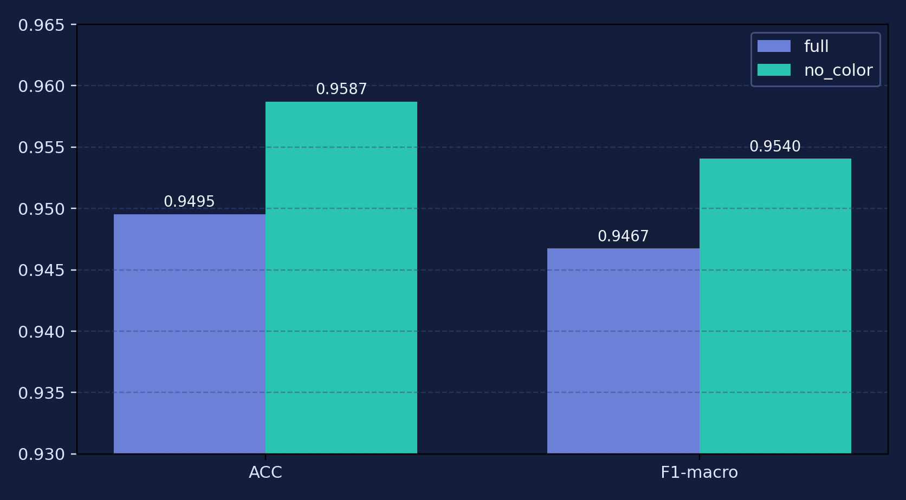
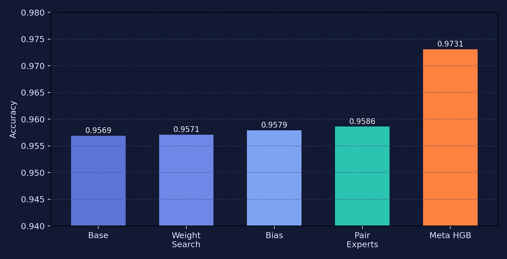
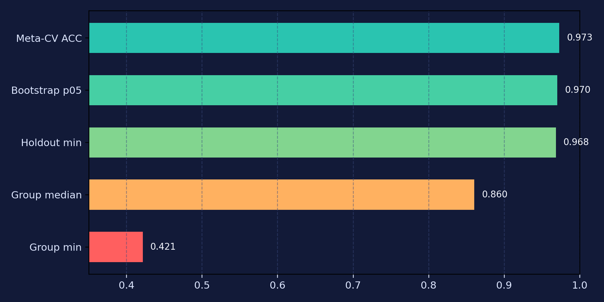
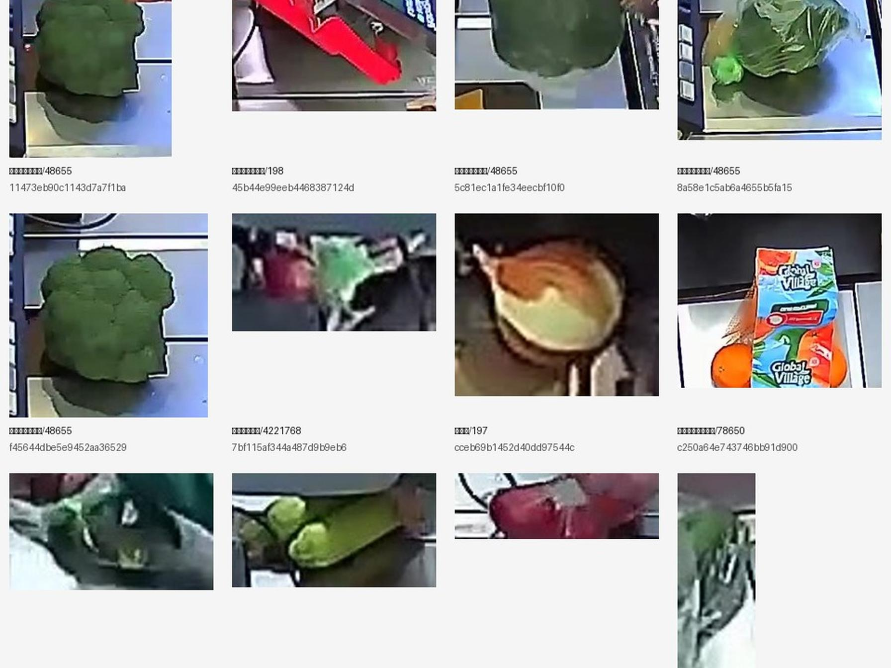

# DL Lab 1 Grocery Classification Solution (Release)

Оформленный репозиторий для воспроизведения решения по соревнованию `dl-lab-1-image-classification` (15 классов фруктов/овощей) и подготовки защиты/презентации.

Статус этого релиза:
- зафиксирован по состоянию на `2026-02-26` (дедлайн-спринт);
- лучший public score на текущем цикле: **`0.97338`** (`mixed old+new + LR(MSE) + geo8`);
- private-часть на момент подготовки этого репозитория **ещё не разобрана**.

## Что здесь есть

Репозиторий собран как `lean release`:
- исходники пайплайнов (`dl_lab1/scripts/`, тренеры, оркестраторы);
- launcher-скрипты для распределённого обучения (MPS/CUDA/Colab/PyCharm);
- curated-артефакты для защиты (финальные сабмиты, summary, fixed folds, Tinder-cleaning actions);
- документация для воспроизведения и презентации;
- placeholders под ссылки на веса/бандлы (Yandex Disk / Google Drive).

Репозиторий **не содержит**:
- исходный датасет соревнования;
- большие checkpoints/веса (`.pt/.pth`);
- большие zip-бандлы (они должны лежать на внешнем диске, ссылки добавляются позже).

## Ключевой результат

Финальный late-stage победитель на public (по состоянию на `2026-02-26`):

- `mixed old+new` orchestrator
- blending: `LR(MSE)` (positive convex weights)
- TTA: `geo8` (только геометрия)
- public score: **`0.97338`**

Файл сабмита в репозитории:
- `artifacts/submissions/mixed_old_new/submission_mixed_lr_mse_geo8_oof_acc.csv`

Стабильный full-CV5 хедж:
- `artifacts/submissions/cv5_all20/submission_cv5_all20_lr_geo8_equal.csv`
- public score: `0.97154`

## Что важно показать преподавателю (уже подготовлено)

Содержимое под требования из сообщения преподавателя:
- какие эксперименты проводились: `docs/EXPERIMENTS_RU.md`
- какие улучшения относительно бейзлайна сработали: `docs/EXPERIMENTS_RU.md` (разделы "Сработало")
- какие идеи ухудшили/не дали прироста: `docs/EXPERIMENTS_RU.md` (раздел "Не сработало / ухудшило")
- идеи дальнейшего улучшения: `docs/EXPERIMENTS_RU.md` + `docs/PRESENTATION_OUTLINE_RU.md`
- как воспроизвести решение: `docs/REPRODUCIBILITY_RU.md`
- что вынести в слайды: `docs/PRESENTATION_OUTLINE_RU.md`

## Команда и зоны ответственности (мягкая формулировка)

Проект велся параллельно по нескольким направлениям: данные, обучение, ансамблирование, проверка гипотез, оформление результатов и воспроизводимости.

- Фёдор Грачёв: основной экспериментальный и интеграционный контур проекта (ключевые тренировочные циклы, оркестраторы и сборка финального решения), а также подготовка воспроизводимого репозитория, презентационных материалов и значимой части Kaggle-проверок/сабмитов.
- Ярослав Кулизнев: активная работа с гипотезами и альтернативными идеями для улучшения пайплайна, обсуждение экспериментальных направлений и проверка части предложений.
- Константин Родионов: параллельные практические задачи по проекту, включая работу с данными и участие в запусках/сопровождении обучения.

Для защиты лучше использовать эту формулировку как нейтральное описание распределения ролей, без "соревновательной" оценки вклада внутри команды.

## Визуальные материалы для презентации

Color ablation (ключевое открытие: `no_color` лучше):



Эволюция ансамбля:



Риск-профиль (public/private shift risk):



Ручная чистка (Tinder-style UI):



## Структура репозитория

```text
.
├── README.md
├── requirements_common_team_train.txt
├── run_me_m2_convnext_small.sh
├── run_friend_gpu_effnetv2s.sh
├── run_friend_m1_deit3_small.sh
├── run_friend_colab_effnetv2s_classaware_harden.sh
├── run_friend_gpu_effnetv2s_pycharm.py
├── dl_lab1/
│   ├── scripts/                       # оркестраторы, обучение, постпроцессинг, Tinder UI
│   ├── train_top1_mps.py              # исторический базовый trainer
│   ├── train_pair_experts_mps.py      # pair-experts trainer
│   ├── TOP1_pipeline_clean_cv_ensemble.ipynb
│   ├── top_new_dataset/README.md      # placeholder (датасет не хранится в git)
│   ├── outputs_post_tinder_convnext_cv2_compare/
│   │   └── folds_used_top_new_dataset_aligned_hybrid.csv
│   └── outputs_night_model_zoo_cv5/   # небольшие примеры итоговых сабмитов/meta
├── artifacts/
│   ├── folds/
│   ├── manual_review/
│   ├── submissions/
│   └── manifests/
├── docs/
│   ├── EXPERIMENTS_RU.md
│   ├── REPRODUCIBILITY_RU.md
│   ├── PRESENTATION_OUTLINE_RU.md
│   ├── RELEASE_CHECKLIST_RU.md
│   └── archive/PROJECT_ANALYSIS_FULL_SOURCE.md
├── assets/
├── data/README.md
└── weights/README.md
```

## Быстрый старт (для команды / проверки)

### 1) Окружение

Python `3.10` или `3.11`.

Сначала установить PyTorch под ваше железо:
- Apple Silicon (M1/M2): `torch/torchvision` с поддержкой `MPS`
- CUDA GPU: `torch/torchvision` с поддержкой `CUDA`

Потом общие зависимости:

```bash
pip install -r requirements_common_team_train.txt
```

### 2) Подготовить данные и веса

См.:
- `data/README.md`
- `weights/README.md`
- `docs/REPRODUCIBILITY_RU.md`

### 3) Запустить split-training (дедлайн-конфиг)

На M2 (ConvNeXt-S):

```bash
bash run_me_m2_convnext_small.sh
```

На CUDA (EffNetV2-S):

```bash
bash run_friend_gpu_effnetv2s.sh
```

На M1 (DeiT3-S):

```bash
bash run_friend_m1_deit3_small.sh
```

## Подтверждённые улучшения (коротко)

- Переход на `no_color` аугментации (A/B на одном фолде дал крупный прирост).
- `SAM + SWA` в дедлайн-конфиге (`SWA` с ранним стартом `swa_start_epoch=5`).
- `label_smoothing=0.03` для `ConvNeXt-S` в финальном конфиге.
- Tinder-style ручная чистка и relabeling train-данных (создан `top_new_dataset`).
- `LR(MSE)` blending + `geo8` TTA.
- Late-stage смешение `old + new` zoo (главный прирост до `0.97338`).

## Что не сработало / ухудшило (коротко)

- Сильные color-aug (подтверждённый вред в этой задаче).
- `stage4 confidence-aware finetune` в текущей реализации (нет прироста на probe).
- `mixed CWR` как финальный public-сабмит (локально обещал, на public хуже `mixed LR`).
- Pair-experts поверх уже сильного `mixed LR` (не ухудшили, но и не улучшили `0.97338`).
- Partial final3 default ensemble на неполном покрытии фолдов/моделей (`0.95882`, smoke only).

Подробности и таблицы: `docs/EXPERIMENTS_RU.md`.

## Ссылки на веса и большие бандлы

Добавлять сюда после загрузки на внешний диск:
- `weights/README.md`

Рекомендуется загрузить:
- `team_bundle_top_new_tinder_plus_ckpts_...zip`
- `team_final3_cv5_split_bundle_...zip`
- отдельные весовые архивы (например, `ConvNeXt-S f0/f1`)

## Источник полной хронологии

Полный рабочий журнал (сырой source-of-truth, с локальными путями и всей последовательностью действий):
- `docs/archive/PROJECT_ANALYSIS_FULL_SOURCE.md`

Для публичного чтения и защиты используйте curated-версии в `docs/`.
